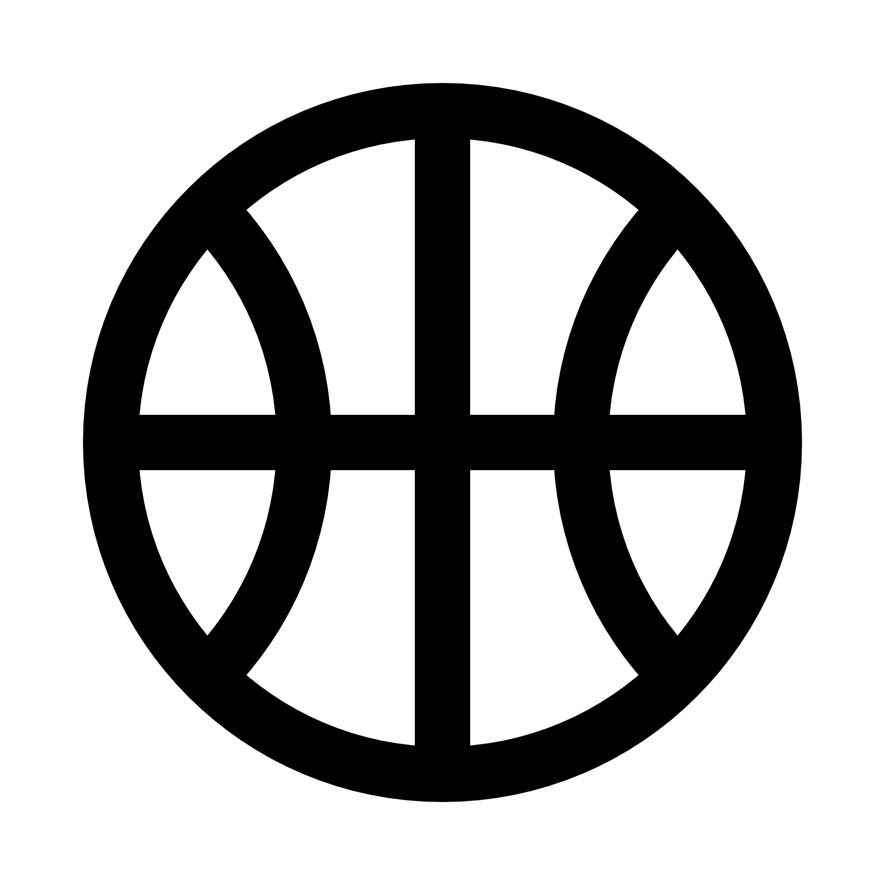

[![Contributors][contributors-shield]][contributors-url]
[![Forks][forks-shield]][forks-url]
[![Stargazers][stars-shield]][stars-url]
[![Issues][issues-shield]][issues-url]
[![MIT License][license-shield]][license-url]
[![LinkedIn][linkedin-shield]][linkedin-url]

<!-- PROJECT HEADER -->
<br />
<p align="center">
    

  <h2 align="center">KD's Final Project</h2>

  <p align="center">
    Currently just a brainstorm exercise
    <br />
    <a href="https://github.com/thekidnamedkd/blockchain-developer-bootcamp-final-project"><strong>Explore the docs »</strong></a>
    <br />
    <br />
    <a href="https://github.com/othneildrew/Best-README-Template">View Demo</a>
    ·
    <a href="https://github.com/othneildrew/Best-README-Template/issues">Report Bug</a>
    ·
    <a href="https://github.com/othneildrew/Best-README-Template/issues">Request Feature</a>
  </p>
</p>


<!-- TABLE OF CONTENTS -->
<details open="open">
  <summary>Table of Contents</summary>
  <ol>
    <li>
      <a href="#about-the-project">About The Project</a>
      <ul>
        <li><a href="#built-with">Built With</a></li>
      </ul>
    </li>
    <li>
      <a href="#getting-started">Getting Started</a>
      <ul>
        <li><a href="#prerequisites">Prerequisites</a></li>
        <li><a href="#installation">Installation</a></li>
      </ul>
    </li>
    <li><a href="#usage">Usage</a></li>
    <li><a href="#roadmap">Roadmap</a></li>
    <li><a href="#contributing">Contributing</a></li>
    <li><a href="#license">License</a></li>
    <li><a href="#contact">Contact</a></li>
    <li><a href="#acknowledgements">Acknowledgements</a></li>
  </ol>
</details>

<!-- ABOUT THE PROJECT -->


[![Product Name Screen Shot][product-screenshot]](https://example.com)
## About The Project
<hr />

### Brainstorm

The basic idea of this dApp is to solve an everyday domestic coordination problem. That problem being shared logins for various paywall sites amongst a micro community (friends, family, online crew). Logins for Netflix, Hulu, NYT, Wired, etc are plentiful, but often hard to keep track of, or current with, across your network. This coordination issue as an MVP presents a fun low lift example of what it takes for a trustless game, while also creating a simple enough tool with real world interest, immediate application, and scalability.

The initial idea is to leverage a smart contract with methods for:

* adding a streaming login
* removing a streaming login
* updating a streaming login
* querying the current login
* flagging a broken streaming login
* initiating a vote to remove a participant
* voting to remove a participant 

Starting simple with a group of 3 separate entrants (accounts) who can each add up to three streaming logins per unique address. Interesting thoughts to anticipate, examine, roadmap, reimagine are:

* people already do this with a spreadsheet
* voting mechanism/time
* financial incentive/auto pay from linked address?

### Built With
These are ideas for the stack:
* [Solidity]()
* [React or Vue]()
* [Ganache]()

<br />

<!-- GETTING STARTED -->
## Getting Started
<hr />
To get a local copy up and running follow these simple steps.

### Prerequisites

This is an example of how to list things you need to use the software and how to install them.
1. npm
  ```sh
  npm install npm@latest -g
  ```

### Installation

1. Clone the repo
   ```sh
   git clone https://github.com/thekidnamedkd/blockchain-developer-bootcamp-final-project
   ```
2. Install NPM packages
   ```sh
   npm install
   ```


<!-- USAGE EXAMPLES -->
## Usage

Use this space to show useful examples of how a project can be used. Additional screenshots, code examples and demos work well in this space. You may also link to more resources.

_For more examples, please refer to the [Documentation](https://example.com)_


<!-- ROADMAP -->
## Roadmap

See the [open issues](https://github.com/othneildrew/Best-README-Template/issues) for a list of proposed features (and known issues).


<!-- CONTRIBUTING -->
## Contributing

Contributions are what make the open source community such an amazing place to learn, inspire, and create. Any contributions you make are **greatly appreciated**.

1. Fork the Project to your own git workflow
2. Create your Feature Branch (`git checkout -b feature/AmazingFeature`)
3. Commit your Changes (`git commit -m 'Add some AmazingFeature'`)
4. Push to the Branch (`git push origin feature/AmazingFeature`)
5. Open a Pull Request against the `staging` branch of repo


<!-- LICENSE -->
## License

Distributed under the MIT License. See `LICENSE` for more information.


<!-- CONTACT -->
## Contact

Kevin Davis - [@thekidnamedkd](https://twitter.com/thekidnamedkd) - whomst@kevind.xyz

Project Link: [https://github.com/thekidnamedkd/blockchain-developer-bootcamp-final-project](https://github.com/thekidnamedkd/blockchain-developer-bootcamp-final-project)


<!-- ACKNOWLEDGEMENTS -->
## Acknowledgements
* ACK 1
* ACK 2
* ACK 3


<!-- MARKDOWN LINKS & IMAGES -->
<!-- https://www.markdownguide.org/basic-syntax/#reference-style-links -->
[contributors-shield]: https://img.shields.io/github/contributors/othneildrew/Best-README-Template.svg?style=for-the-badge
[contributors-url]: https://github.com/thekidnamedkd/blockchain-developer-bootcamp-final-project/graphs/contributors
[forks-shield]: https://img.shields.io/github/forks/othneildrew/Best-README-Template.svg?style=for-the-badge
[forks-url]: https://github.com/thekidnamedkd/blockchain-developer-bootcamp-final-project/network/members
[stars-shield]: https://img.shields.io/github/stars/othneildrew/Best-README-Template.svg?style=for-the-badge
[stars-url]: https://github.com/thekidnamedkd/blockchain-developer-bootcamp-final-project//stargazers
[issues-shield]: https://img.shields.io/github/issues/othneildrew/Best-README-Template.svg?style=for-the-badge
[issues-url]: https://github.com/thekidnamedkd/blockchain-developer-bootcamp-final-project/issues
[license-shield]: https://img.shields.io/github/license/othneildrew/Best-README-Template.svg?style=for-the-badge
[license-url]: https://github.com/thekidnamedkd/blockchain-developer-bootcamp-final-project/blob/master/LICENSE.txt
[linkedin-shield]: https://img.shields.io/badge/-LinkedIn-black.svg?style=for-the-badge&logo=linkedin&colorB=555
[linkedin-url]: https://linkedin.com/in/kevinrobertdavis
[product-screenshot]: images/product.png
